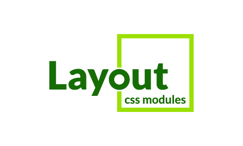

<p align="center">
    
</p>

# Layout CSS Modules

## Installation

You can install Layout CSS Modules using npm:

```bash
npm install layout-css-modules
```

## Usage

```tsx
import {} from "layout-css-modules";

```

## License

Layout CSS Modules is licensed under the [MIT](./LICENSE) License.
